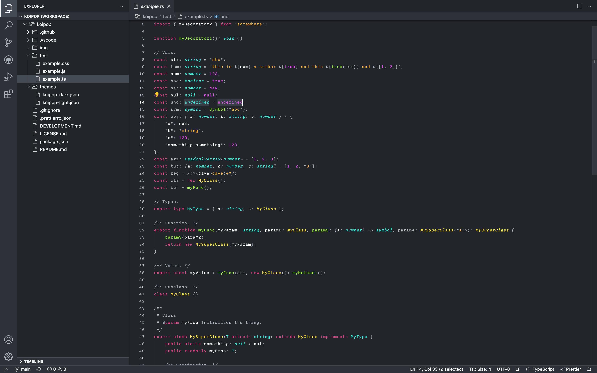

# Koipop

**Color theme** for VS Code. **UI elements** use a scale of _cool gray_ and are intended to be clean and consistent. **Code tokens** use _vibrant, assertive, bright_ colors and are intended to be readable, consistent, and quick for your eyes to scan.

